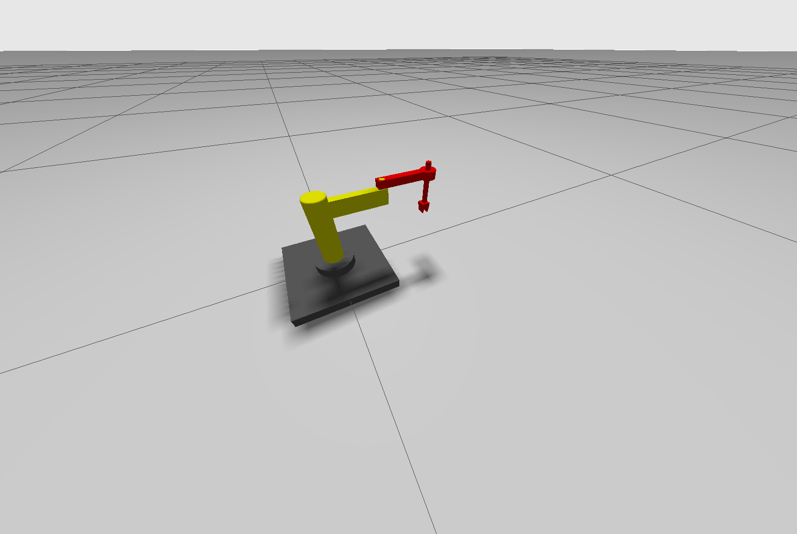

# ROS2 Robotic Arm Project

This project involves the development of a robotic arm using ROS2 (Robot Operating System 2). The robotic arm is simulated in Gazebo, controlled through ROS2 nodes, and equipped with various configuration and control capabilities.

## Project Structure

```plaintext
ros2_ws/
├── README.md               # Project documentation
├── build/                  # Build files and intermediate outputs
├── install/                # Installed ROS2 packages and dependencies
├── log/                    # Build and runtime logs
├── src/                    # Source code of the project
│   └── robot_arm/          # Main robotic arm package
│       ├── config/         # Configuration files (controllers, RViz settings)
│       ├── include/        # Header files
│       ├── launch/         # ROS2 launch files
│       ├── meshes/         # 3D STL models for the robotic arm
│       ├── scripts/        # Python scripts (e.g., motion control)
│       ├── urdf/           # URDF/XACRO files for the robot description
│       ├── worlds/         # Gazebo simulation worlds
│       └── src/            # C++ source files (if any)
```

## Features

- **URDF/XACRO**: Descriptions for the robotic arm's physical structure.
- **Control System**: Configurable ROS2 control files for manipulating the robotic arm.
- **Simulation**: Gazebo worlds and launch files for testing in virtual environments.
- **RViz Visualization**: Visualization setup for robot interaction.
- **Python Script**: Custom scripts for robotic arm motion.

## Installation and Setup

1. Clone this repository into your ROS2 workspace:

   ```bash
   git clone https://github.com/Duks31/robot-arm ~/ros2_ws/src
   ```

2. Build the workspace:

   ```bash
   cd ~/ros2_ws
   colcon build
   ```

3. Source the workspace:

   ```bash
   source install/setup.bash
   ```

## Running the Simulations

### Launch the Robotic Arm in Gazebo

```bash
ros2 launch robot_arm gazebo.launch.py
```

### Control the Robotic Arm

```bash
ros2 launch robot_arm controller.launch.py
```

### Visualize in RViz

```bash
ros2 launch robot_arm display.launch.py
```

## Configuration Files

- **Controller Configuration**: `config/controller.yaml` defines joint controllers.
- **URDF/XACRO Models**: Located in `urdf/`, these describe the robotic arm's structure and dynamics.

## Scripts

- **`scripts/move_arm.py`**: A Python script to command the robotic arm to specific positions.

## Contributing
Contributions are welcome  :)

*Note: The project is a work in progress.*

```
[Err] [SystemLoader.cc:94] Failed to load system plugin [libign_ros2_control-system.so] : couldn't find shared library.
```
